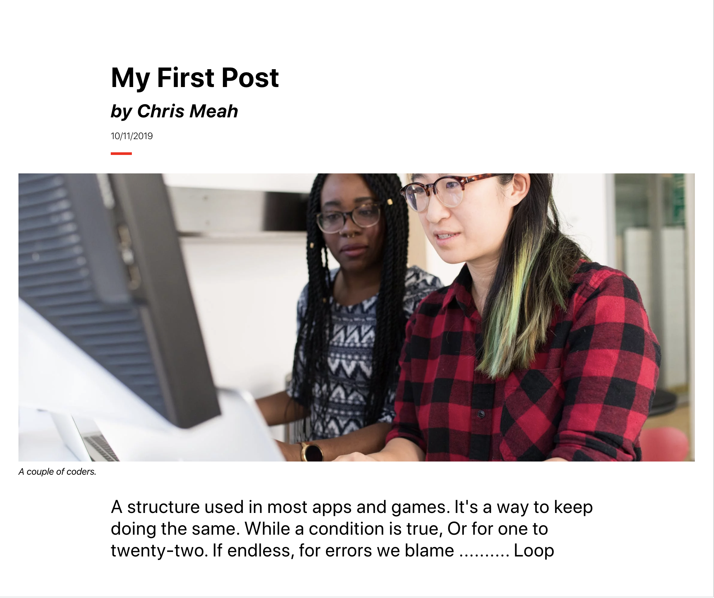

[](https://classroom.github.com/online_ide?assignment_repo_id=6656982&assignment_repo_type=AssignmentRepo)
# React Recap Tasks

## Feedback

Feedback is a vital part of continual improvement and the hero's journey of growth you're on on this course. As part of this, please click [here](https://forms.gle/BJWLNvSgKsp9rkbF8) to fill out the peer review form for each person in the group you've worked with this week.

## Tasks

For these tasks, you'll put what you've learned last week together to create a blog app with components that display posts and comments and allow users to add new comments.

Click [here](Final.png) to see an example of what the final result should look like!

### Task 1 - BlogPost

Create a component `BlogPost` to which has the job of displaying a blog post. Blog posts are represented by the following data:

```JavaScript
{
  title: "My First Post",
  author: "Chris Meah",
  datePosted: "20/11/2019",
  text: `
    A structure used in most apps and games.
    It's a way to keep doing the same.
    While a condition is true,
    Or for one to twenty-two.
    If endless, for errors we blame
    ..........
    Loop `,
  image:
    "https://images.pexels.com/photos/1181472/pexels-photo-1181472.jpeg?auto=compress&cs=tinysrgb&dpr=2&h=750&w=1260",
  alt: "A couple of coders."
}
```



## Task 2 - Comment

Create a component `Comment` which displays a comment. Comments are made of the following properties:

```JavaScript
{
  author: "Billy Bootcamper",
  text: "Hello, great post"
}
```

Your task is to display the author and comment. Once you've displayed this, make the author's avatar, which is the first letters of the commentor's name capitalised in a nice little circle like the image below.


## Task 3 - CommentList

Create a component `CommentList` which should take in a list of comments and render a `Comment` component for each item in the list.

```JavaScript
[{ author: "Billy Bootcamper", text: "Hello, great post" },{ author: "Chris Meah", text: "Many thank yous" }]
```

The comments should be stored in state at the top level of your application.

## Task 4 - CommentForm

Create a component `CommentForm` which should allow a user to input their name and comment, and then add this comment to the list. Behaviour should include:

- On pressing the button, a comment should be added to the list
- If the comment is empty, do not add it
- Provide a default username
- After a comment is added, clear the comment field but not the username


## Task 5 - CommentsSection

Create a component `CommentsSection` which contains the `CommentsList` and the `CommentForm` components.

## Result


